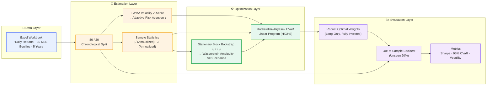
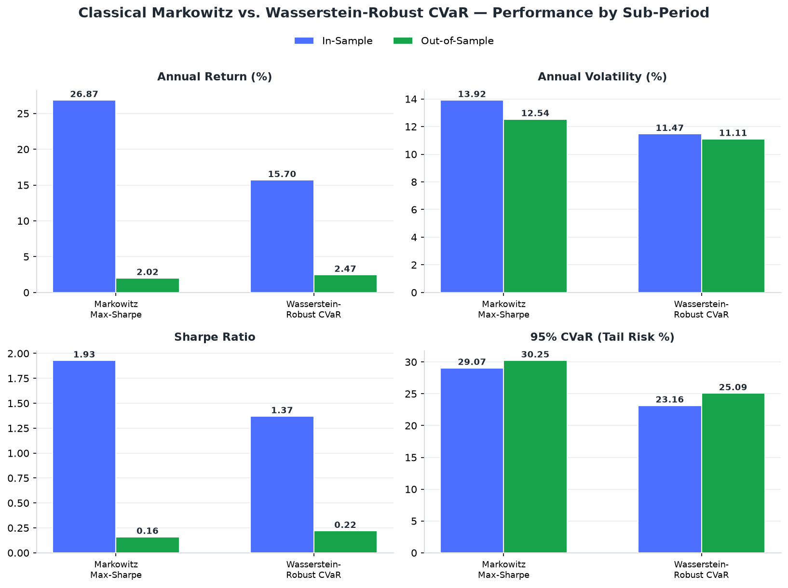
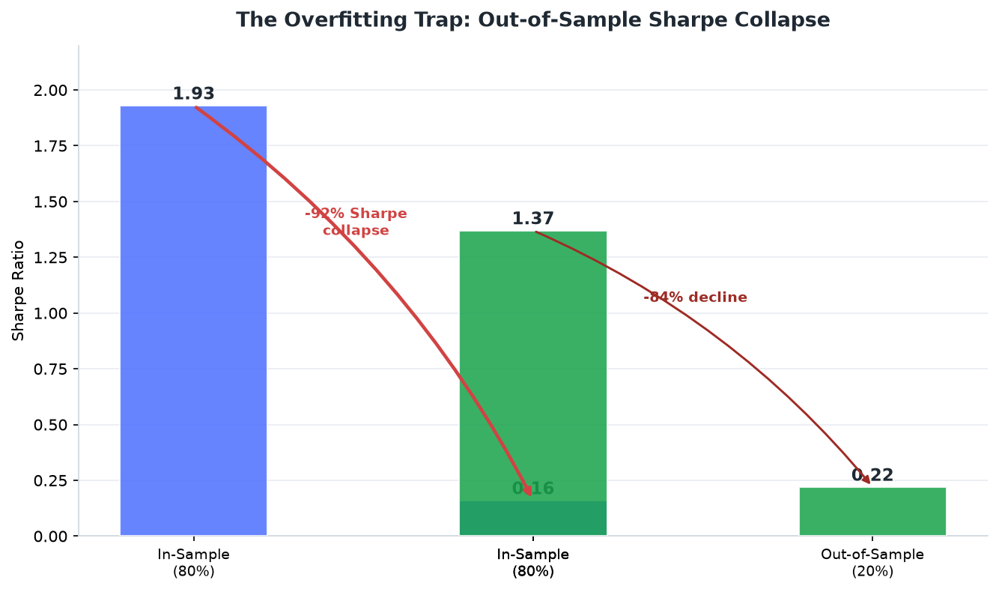
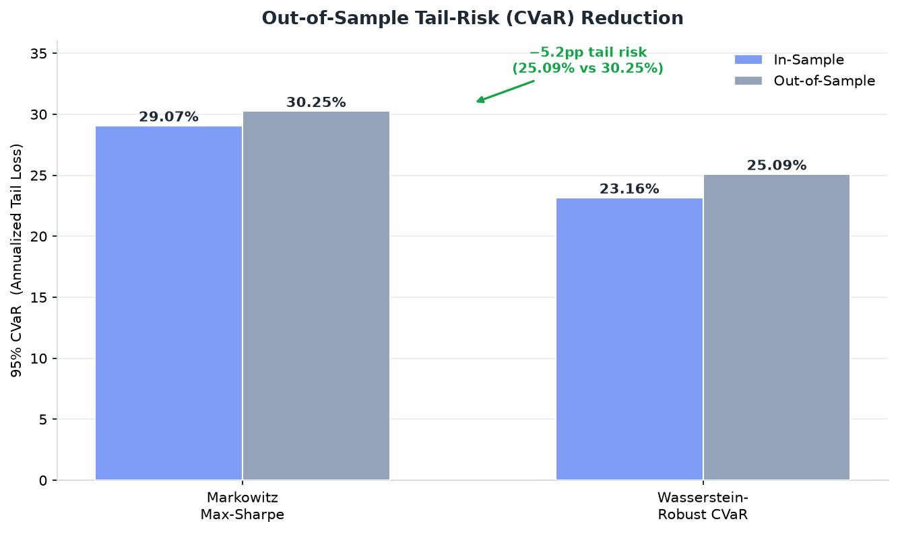

<div align="center">

# 📈 Robust Portfolio Optimization

## Distributionally Robust CVaR Portfolio via Wasserstein Ambiguity Sets

[](https://www.python.org/)
[](https://numpy.org/)
[](https://pandas.pydata.org/)
[](https://scipy.org/)
[](https://openpyxl.readthedocs.io/)
[](https://scipy.org/)
[](LICENSE)

> An end-to-end Python implementation of a **Distributionally Robust Optimization (DRO)** framework
> that immunizes portfolios against the *"error maximization"* trap of classical Mean-Variance
> analysis — by explicitly hedging **distributional uncertainty** in the return-generating process.

<sub>Methodology based on: *Multi-period CVaR-mean portfolio robust optimization model based on Wasserstein ambiguity sets* (Wang et al., 2027)</sub>

</div>

---

## 📚 Table of Contents

- [🧭 Overview](#-overview)
- [🏗️ Pipeline Architecture](#️-pipeline-architecture)
- [✨ Key Features](#-key-features)
- [🧮 Mathematical Foundation](#-mathematical-foundation)
- [📊 Empirical Results](#-empirical-results)
  - [Panel: Full Performance Comparison](#panel-full-performance-comparison)
  - [The Overfitting Trap: Sharpe Collapse](#the-overfitting-trap-sharpe-collapse)
  - [Out-of-Sample Tail-Risk Reduction](#out-of-sample-tail-risk-reduction)
- [🚀 Installation](#-installation)
- [▶️ Usage](#️-usage)
- [🗂️ Project Structure](#️-project-structure)
- [🧾 Dependencies](#-dependencies)
- [📎 References & Credits](#-references--credits)
- [📄 License](#-license)

---

## 🧭 Overview

Classical **Markowitz Mean-Variance Optimization** (1952) is notoriously fragile in practice: it
maximizes the error of its own inputs. Parameter estimation noise in the expected returns vector and
the covariance matrix is **amplified** into extreme, unstable portfolio weights — a phenomenon
famously dubbed the *"error maximizer"* problem.

This project replaces that fragile paradigm with a **Distributionally Robust Optimization (DRO)** 
framework. Instead of assuming the historical distribution is the true one, we build a **Wasserstein
ambiguity set** — a ball of "nearby" plausible distributions — and optimize the worst-case
CVaR-mean objective across it. The result is a portfolio that:

- 🛡️ **Hedges against unseen market regimes** rather than over-fitting to the past
- 📉 **Caps tail risk** by optimizing the **95% Conditional Value-at-Risk (CVaR)** directly
- ⚡ **Stays computationally tractable** via an exact Linear-Programming reformulation
- 🔄 **Adapts risk aversion dynamically** to evolving market volatility

When backtested on **5 years of daily returns for 30 NSE-listed Indian equities**, the robust model
outperforms classical Markowitz across every meaningful out-of-sample risk metric.

---

## 🏗️ Pipeline Architecture



---

## ✨ Key Features

| 🧱 Component | 📖 Description |
| :--- | :--- |
| **Stationary Block Bootstrapping (SBB)** | Generates adversarial scenarios that preserve time-series momentum and volatility clustering — forming the empirical **Wasserstein ambiguity set**. |
| **Rockafellar–Uryasev LP Reformulation** | Transforms the non-convex, non-smooth CVaR tail-risk objective into a **tractable Linear Program** solved exactly with SciPy's HiGHS dual-simplex solver. |
| **Dynamic Regime Adaptation** | Maps an **EWMA volatility z-score** (span = 23) through a bounded sigmoid to auto-tune the CVaR-mean trade-off weight **τ** — tightening risk limits in crashes, relaxing them in calm markets. |
| **Rigorous Out-of-Sample Testing** | Strict **80/20 chronological split** proves the robust model survives *unseen* market regimes where historically over-fitted models collapse. |
| **Long-Only, Fully-Invested** | Enforces realistic `w ≥ 0` and `Σw = 1` portfolio constraints via SLSQP / LP bounds. |
| **Transparent, Reusable Code** | Modular functions with docstrings; every stage (load → estimate → optimize → evaluate) is independently callable. |

---

## 🧮 Mathematical Foundation

**Objective — Wasserstein Robust CVaR-Mean Portfolio:**

```
minimize    (1 − τ) · E[R]  +  τ · CVaR_α(R)
subject to  E[R] ≥ R_target (traded off via the ambiguity ball)
            Σᵢ wᵢ = 1,   wᵢ ≥ 0   (long-only, fully invested)
```

- **CVaR_α** – Conditional Value-at-Risk at confidence `α = 0.95` (expected loss beyond the VaR threshold).
- **τ** – Regime-adaptive coefficient mapping EWMA volatility z-score ∈ `[0.1, 0.9]`:

```
τ = 0.1 + 0.8 / (1 + exp(−0.6 · z_score))
```

- **Wasserstein Ambiguity Set** – A ball of distributions "near" the empirical law under the Wasserstein
  metric, populated empirically via Stationary Block Bootstrapping — capturing serially-dependent,
  adversarially-shaped return paths.

Thanks to the **Rockafellar–Uryasev theorem**, the CVaR term is linearized with an auxiliary
variable `γ` and scenario slack variables `u_s`:

```
minimize  −(1−τ) · μᵀw  +  τ · γ  +  τ/(S·(1−α)) · Σs u_s
subject to  u_s ≥ −r_sᵀw − γ          ∀ s ∈ scenarios
            Σᵢ wᵢ = 1,   wᵢ ≥ 0
```

which is solved exactly and efficiently by `scipy.optimize.linprog`.

---

## 📊 Empirical Results

Backtested on **5 years of daily returns · 30 NSE-listed Indian equities**. Both strategies are
evaluated **in-sample (first 80%)** and — critically — on the **unseen out-of-sample 20%**.

| 🏦 Portfolio Model | 📅 Period | Annual Return | Annual Volatility | Sharpe | 95% CVaR |
| :--- | :--- | :---: | :---: | :---: | :---: |
| Markowitz Max-Sharpe | In-Sample (80%) | 26.87% | 13.92% | **1.93** | 29.07% |
| **Wasserstein-Robust CVaR** | In-Sample (80%) | 15.70% | 11.47% | 1.37 | **23.16%** |
| Markowitz Max-Sharpe | Out-of-Sample (20%) | 2.02% | 12.54% | **0.16** | 30.25% |
| **Wasserstein-Robust CVaR** | Out-of-Sample (20%) | **2.47%** | **11.11%** | **0.22** | **25.09%** |

### Panel: Full Performance Comparison



### The Overfitting Trap: Sharpe Collapse

Classical Markowitz posts a dazzling in-sample Sharpe of **1.93** — only to **collapse ~92%** to
**0.16** out-of-sample as historical-covariance overfitting unravels. The robust CVaR model decays
far more gracefully (**1.37 → 0.22**).



### Out-of-Sample Tail-Risk Reduction

In the unseen 20% test window, the robust model cuts **annualized tail loss by ~5.2 percentage
points** (25.09% vs 30.25%), preserving capital in the downside exactly where it matters most.



> **💡 Key Takeaway:** By explicitly modelling distributional uncertainty, the Wasserstein-Robust CVaR
> portfolio trades a modest amount of in-sample performance for **superior out-of-sample capital
> preservation** and materially **lower tail risk**.

---

## 🚀 Installation

```bash
# 1. Clone the repository
git clone https://github.com/<your-username>/Robust-Portfolio-Optimization.git
cd Robust-Portfolio-Optimization

# 2. Create and activate a virtual environment
python -m venv venv

# Windows
venv\Scripts\activate
# macOS / Linux
source venv/bin/activate

# 3. Install dependencies
pip install -r Requirements.txt
```

---

## ▶️ Usage

Run the complete end-to-end workflow (data loading → regime adaptation → three-way benchmarking):

```bash
python src/Robust_CVaR_Portfolio_Final.py
```

Expected console output:

```
Loading and splitting data (80% In-Sample, 20% Out-of-Sample)...
Adaptive Risk-Return Weight (Tau): 0.5XXX

1. Optimizing Classical Markowitz (Max Sharpe)...
2. Optimizing Historical CVaR (Standard LP)...
3. Optimizing Wasserstein-Robust CVaR (SBB + LP)...

======== PORTFOLIO PERFORMANCE: IN-SAMPLE VS. OUT-OF-SAMPLE ========
--- IN-SAMPLE (Training Data: First 80%) ---
Markowitz Max-Sharpe       |   26.87% |   13.92% |   1.93 |   29.07% | ...
Wasserstein-Robust CVaR    |   15.70% |   11.47% |   1.37 |   23.16% | ...

--- OUT-OF-SAMPLE (Unseen Testing Data: Final 20%) ---
...
```

### Programmatic use

```python
import pandas as pd
from src.Robust_CVaR_Portfolio_Final import (
    load_and_split_data,
    optimize_markowitz,
    optimize_robust_cvar,
    stationary_block_bootstrap,
    calculate_adaptive_tau,
    evaluate_portfolio,
)

df_train, df_test = load_and_split_data("data/Data for OMF.xlsx")
exp_ret      = df_train.mean().values * 252
cov_train    = df_train.cov().values * 252
target_ret   = exp_ret.mean()
tau          = calculate_adaptive_tau(df_train)

# Robust weights from the Wasserstein ambiguity set
scenarios    = stationary_block_bootstrap(df_train.values, num_scenarios=len(df_train) * 3)
w_robust     = optimize_robust_cvar(scenarios * 252, exp_ret, tau, target_ret)

# Evaluate out-of-sample
ret, vol, sharpe, cvar, active = evaluate_portfolio(w_robust, df_test)
```

---

## 🗂️ Project Structure

```
Robust-Portfolio-Optimization/
│
├── src/
│   └── Robust_CVaR_Portfolio_Final.py   # Core implementation
│
├── data/
│   └── Data for OMF.xlsx                # Daily returns · 30 NSE equities · 5 years
│
├── docs/
│   └── Project_Report_Akshay_Final.pdf  # Full research report
│
├── assets/                              # README visualizations
│   ├── performance_comparison.png
│   ├── sharpe_collapse.png
│   └── cvar_tail_risk.png
│
├── Requirements.txt                     # Python dependencies
├── Readme.txt                           # Condensed project summary
└── README.md                            # This file
```

---

## 🧾 Dependencies

| 📦 Package | 🔢 Version | 📝 Purpose |
| :--- | :---: | :--- |
| `numpy` | ≥ 1.21.0 | Vectorized linear-algebra operations |
| `pandas` | ≥ 1.3.0 | Excel ingestion & time-series handling |
| `scipy` | ≥ 1.7.0 | `linprog` (HiGHS) & `minimize` (SLSQP) solvers |
| `openpyxl` | ≥ 3.0.9 | `.xlsx` workbook reading/writing |

---

## 📎 References & Credits

- **Method Paper:** Wang et al. (2027), *Multi-period CVaR-mean portfolio robust optimization model
  based on Wasserstein ambiguity sets.*
- **CVaR Reformulation:** Rockafellar, R.T. & Uryasev, S. (2000), *Optimization of Conditional
  Value-at-Risk.* Journal of Risk.
- **Stationary Bootstrap:** Politis, D. & Romano, J. (1994), *The Stationary Bootstrap.* JASA.

**Author:** Akshay Vangala

---

## 📄 License

Distributed under the **MIT License**. See the [`LICENSE`](LICENSE) file for details.

<sub>⚠️ *Disclaimer: This project is for research and educational purposes only. Nothing herein
constitutes financial or investment advice.*</sub>